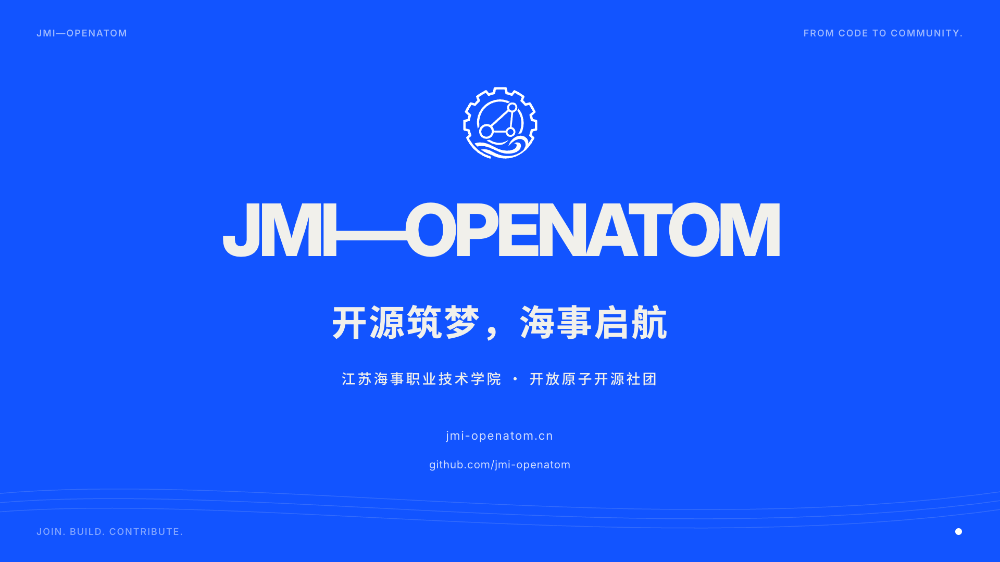

# JMI-OPENATOM · From Code to Community

江苏海事职业技术学院 · 开放原子开源社团品牌动画。

当前主版本：**82.5 秒 · 1920×1080 · 原生 60fps · 128 BPM**。主视觉采用纸白、墨黑、电光蓝；重切字体、弹性字形、贴纸标签、分片转场、三维原子和校园实景共同构成品牌动效。

品牌口号：**开源筑梦，海事启航**。中文为主，Git 高潮段保留英文。



完整成片可从 [GitHub Releases](https://github.com/jmi-openatom/openatom-motion/releases/latest) 下载。

## 预览与导出

```bash
git clone git@github.com:jmi-openatom/openatom-motion.git
cd openatom-motion
npm ci
npm run start
npm run render:film
```

完整版预览：<http://localhost:3000/JMI-BRAND-FILM>

- `npm run render:film`：1080p60，输出 `out/jmi-openatom-brand-film.mp4`。
- `npm run render:preview`：960×540、60fps 预览。
- `npm run render:brand`：保留已确认的 15 秒、30fps 风格样片。
- `npm run typecheck`：TypeScript 检查。
- `npm run verify`：验证文字/创意提示帧与实际音轨生成器记录的重音起始帧。
- `npm run stills`：导出拍点及拍间变形关键帧。

ANGLE 用于 WebGL 渲染。所有动画由帧号驱动，支持跳帧与并行渲染。

## 时间线

176 拍，4950 帧，82.5 秒。段落与音轨共同读取 `src/brand/full-score.json`。

| 时间 | 镜头 |
| --- | --- |
| 0–8.44s | CODE / OPEN 弹性大字、符号变原子、中文创造宣言 |
| 8.44–15.94s | Web / Server / AI / OpenHarmony |
| 15.94–27.19s | 社团系统图形变形；构建、测试、部署、上线 |
| 27.19–34.69s | 想法分叉、协作合并，让灵感汇成贡献 |
| 34.69–44.06s | 校园实景与音乐留白 |
| 44.06–51.56s | 代码折成帆船，开源筑梦、海事启航 |
| 51.56–59.06s | 学习、创造、分享、贡献；个人节点汇成社区 |
| 59.06–66.56s | 英文 Git 词汇、大字形变、颜色切换与节奏加速 |
| 66.56–74.06s | 中文开源宣言、波浪字形与分片退场 |
| 74.06–82.50s | 中文主题、扩展蓝色圆、Logo、slogan 和品牌定格 |

文字采用短距离位移、遮罩揭示、淡出交接与轻微收势。落点后保持清晰阅读姿态；移除持续波浪、夸张挤压、翻折与循环回弹。英文高潮保留拍点，但蓝、黑、纸白按段落切换，减少频繁闪变。

音轨为程序生成的原创节奏、旋律和音效，未采样参考视频音频。使用 Python + numpy 运行 `scripts/generate-brand-film-score.py` 可重新生成。WAV 已保存在 `public/audio/brand-film.wav`，预览和导出不依赖 Python。

`out/audio-onsets.json` 记录生成器真正写入的音效起始采样，`out/beat-sync.json` 记录视觉边界校验。数学同步检查不能替代带声音的连续播放审看。

## 素材与来源

参考用户提供的两段视频的节奏、文字变形及剪辑语言；成片的文案、图形、字体排版、帆船和音乐由本项目实现。

优先读取 `public/activities/` 图片，随后读取 `public/campus/`。当前活动目录没有活动实景照片，片中使用已有校园照片。项目模块、设备和 AI 跟踪为视觉设计演示。

完整版结尾 Logo：`public/logo/jmi-openatom-outro-white.svg`，来自用户提供的 JMI-OPENATOM Logo 素材包，使用白色透明底的齿轮、协作节点与海浪图标。原始矢量路径直接用于渲染，沿用结尾的蓝色背景与入场节奏。历史样片和封面使用的旧 Logo 保存在 `public/logo/jmi-openatom.png`。字体：Inter / Noto Sans SC，许可证保存在 `public/fonts/`。

## 主要实现

- `src/brand/BrandFilm.tsx`：完整版编排。
- `src/brand/full-score.json`、`sync.ts`：共享拍点与原生输出帧时钟。
- `src/brand/FlyingType.tsx`：曲线飞入飞出、翻折、遮罩。
- `src/brand/ElasticLetters.tsx`：逐字弹性变形与描边显露。
- `src/brand/MotionLanguage.tsx`：贴纸、网格、旋转星芒、字体叠影、分片快门。
- `src/brand/Imagination.tsx`：贡献与启航新增镜头。
- `src/brand/People.tsx`：校园、社区、英文高潮与中文宣言。
- `src/brand/BrandOutro.tsx`：连续品牌收尾。

`JMI-OPENATOM` 保留前期三维隧道方案；`JMI-BRAND-STUDY` 保留 15 秒风格样片。历史导出保存在 `out/`，最早版本源码保存在 `out/legacy-source-before-rebuild.zip`。

## 发布素材

`npm run covers` 导出 1080×1920 竖版封面和 1920×1080 横版封面。封面主视觉由内置 ImageGen 生成，文字、Logo 及配色由 Remotion 确定性排版。成品和抖音文案位于 `out/social/`；生成提示词与说明见 `out/social/cover-production-notes.md`。

## 开源许可

项目使用 [MIT License](LICENSE)。第三方字体保留各自的 SIL Open Font License，详情见 `public/fonts/` 中的许可证文件。
